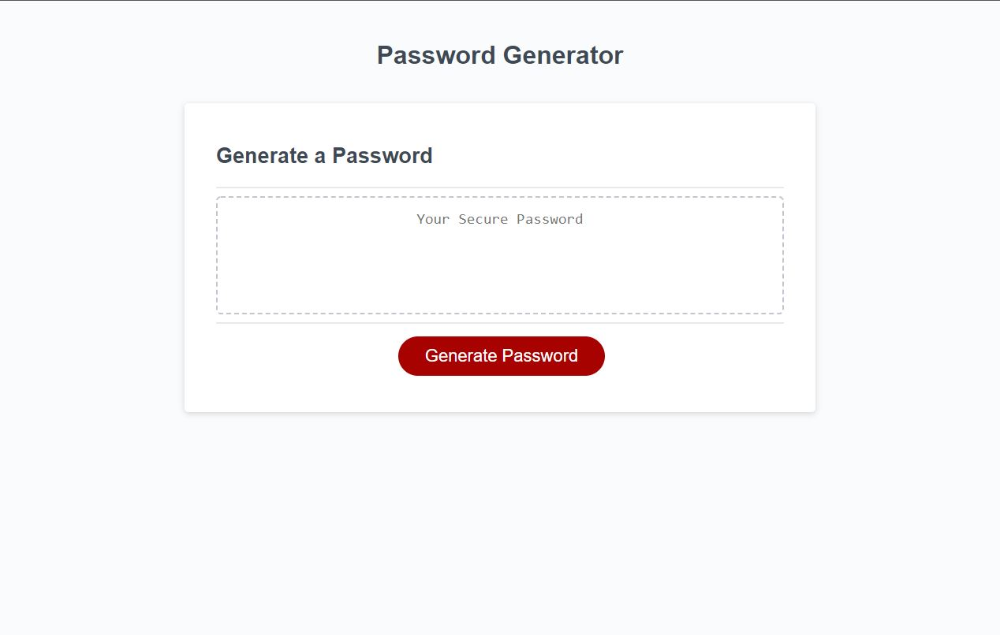

# Password Time

## Description

This is my third challenge for the UofU bootcamp.  In it you will find a password generator that will create a random password based on your selected parameters.  First you will be asked to set the length and then choose if you would like to include lowercase letters, uppercase letters,  symbols and numbers.  Afterwards it will provide you a password in the central text display area.

## What I Learned

A little bit of everything and a little bit of nothing.  As my first ever JavaScript project this was overwhelming to say the least.  There was simply too much information to feel like I absorbed everything properly but I'm pleased with the end product.  The biggest thing I have learned is that JavaScript will require tons of practice.  I am hoping to build a little something in JavaScript each week to continue to climb this mountain.

https://johnknee3.github.io/Password-Time/
 
